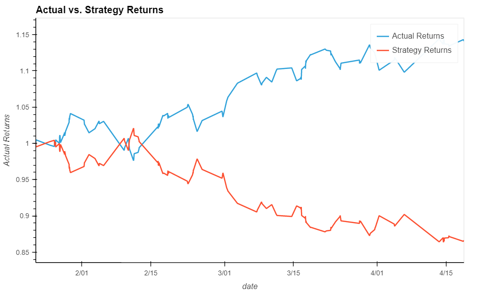

# Challenge14

## Models

### Baseline

As a baseline for this project we use a trading strategy based on support vector machine algorithm, in which we use the rolling window data to generate the signal.
As a first solution we develop a SVM algorithm that takes as input features two rolling windows: a fast one with period of 4 days and a slow one with period of 100 days.
We split the dataset into training and testing, each having three months of data, and we scale them.
After fitting the model on the training dataset, we make predictions on the training and testing data.
We see that our model doesn't perform well since it is always predicting a buy signal, hence the actual return and the strategy return will be overlapped. If we plot the graph we get.

### Tuned model

Since we have a lot of data but we used just few of them, we try by increasing the training period to one year. We adjust also the rolling windows, since 4 and 100 may be too far apart. By getting them closer we may end up with a more sensitive signal generation. For the scope we use 4 and 9 days moving windows.
After training we test the strategy and we can see that the model is capturing better the alternating buy and sell signals. Nonetheless our precision and recall are below 50%, so it is strongly suggested to refine the model.

### Different algorithm

We keep the same parameters: rolling window (period 4), rolling window (period 9), training size 12 months, testing size 3 months.
The new classifier we'll be using is the Logistic Regression, from the sklearn.linear module. In this case we have a model that slightly improve the f1-score for the testing set, so for further development it would be interesting to use different or even more moving average with this kind of classifier.

To conclude we can say that due to the complexity of the data at hand, it is required to use a more complex classifier able to detect hidden patterns in the data at hand.